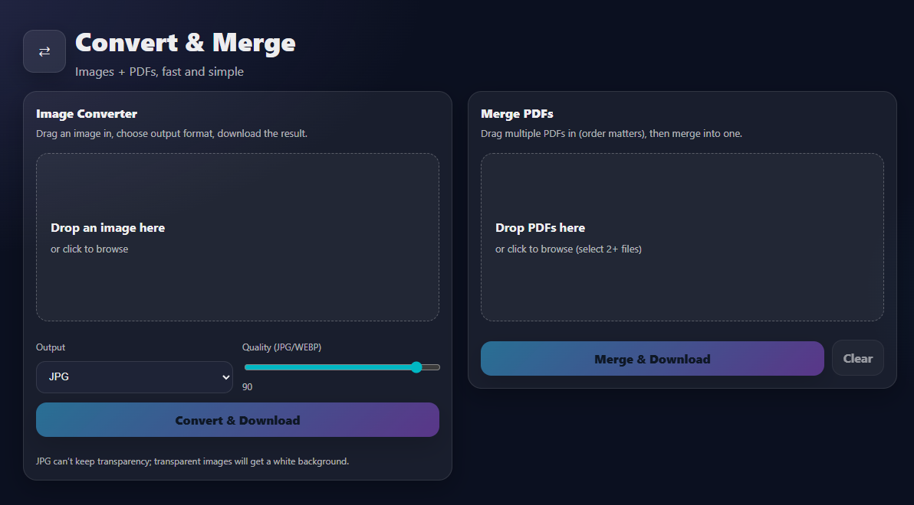

# Image Converter

A web app to convert images between formats and merge PDFs for free.


## Features

- Convert file type of images
- Edit image quality
- Merge any number of PDFs


## Tech Stack

**Frontend:** React, HtML, CSS

**Backend:** Python, Pillow, PyPDF2

**Server:** FastAPI, Netlify


## Usage

**1.** Open the website [here](link).

**2.** Upload an image or multiple PDFs.

**3.** Choose the desired output format, or merge PDFs.

**4.** Download the converted file. 
## Run Locally

Clone the project

```bash
  git clone https://github.com/Arowe14/Image-Converter
```

Go to the project directory

```bash
  cd Image-Converter
```

Install dependencies

```bash
  pip install -r requirements.txt
  npm install
```

Start the server

```bash
  npm run start
```


## Screenshots




## Authors

- [Alex Rowe](https://www.github.com/Arowe14)

